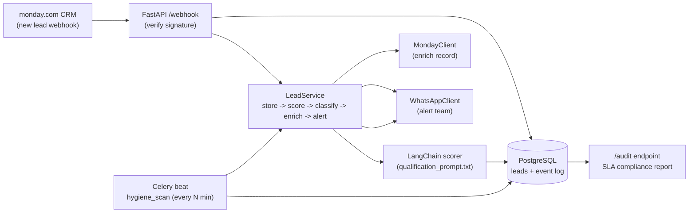

# Lead Qualification & Scoring Agent — Build Plan

> Client: **Beyond Oil** (food-tech — frying-oil filter powder for food-service / industrial frying).
> Goal: an agent that ingests monday.com CRM webhooks, scores + classifies every inbound lead
> (Hot/Warm/Cold, distributor vs end-customer), enriches the CRM, fires WhatsApp alerts, and
> enforces pipeline hygiene (zero leads unscored >24h).
>
> Stack (per user direction): **FastAPI + LangChain**, monday.com webhooks, WhatsApp Business API
> (or Twilio WhatsApp), PostgreSQL, Celery, Railway.

---

## 1. SLA Targets (the contract we must meet)

| Metric | Target | How we prove it |
|---|---|---|
| Lead scoring latency | 100% scored within **5 min** of intake | `created_at` → `scored_at` persisted in Postgres |
| WhatsApp alert latency | alert within **2 min** of qualification | `scored_at` → `alerted_at` |
| Pipeline hygiene | **zero** leads unscored >24h | Celery hygiene scan + audit report |

Every state transition writes a timestamp. SLA measurement is first-class, not an afterthought.

---

## 2. Tech Stack & Key Decisions

- **FastAPI** — webhook receiver + REST audit endpoints. Async, typed, easy TestClient.
- **LangChain** — drives the scoring/classification step via a structured-output LLM call
  using `app/prompts/qualification_prompt.txt`. (LangGraph optional; not needed for v1 — single
  linear chain. Add later only if branching logic appears.)
- **PostgreSQL** — source of truth. Stores leads, scores, plus an event log of retries/failures
  (paste #4: "Store: logs scores retries failures").
- **Celery + Redis** — scheduler for the hygiene scan (24h unscored sweep). Decouples periodic
  work from the web process; survives restarts; gives retries/backoff for free.
- **monday.com API** — inbound webhook (new-item trigger) + outbound enrichment (update status,
  classification, rationale columns).
- **WhatsApp Business Cloud API** (preferred) **or Twilio WhatsApp** — alert delivery.
  Selected by `ALERT_PROVIDER` env. Both behind one `WhatsAppClient` interface.
- **Railway** — deploy (web service + worker + Postgres + Redis add-ons).
- **pytest + Starlette TestClient** — tests. **Mock adapters** let the whole pipeline run with
  zero credentials so it is verifiable locally today.

### Mock-vs-live adapters
`monday_client.py` and `whatsapp_client.py` expose interfaces with `Mock*` (log/file-backed) and
`Live*` (real HTTP) implementations selected by `ADAPTER_MODE`. Core logic is identical in both;
only transport changes. This is what makes the build runnable before any credential exists.

---

## 3. Architecture / Request Flow



Trust boundaries: **webhook signature** before anything runs → **LangChain output validated**
(score int, tier in {Hot,Warm,Cold}, classification in {distributor,end_customer}) before any
write/alert → **alert side-effect** is the only externally-visible action, so it is guarded by
retry/backoff and only fired after a successful score.

---

## 4. File Tree (based on user sketch, paste #2, expanded)

```
lead-agent/
├── app/
│   ├── api/
│   │     webhook.py            # POST /webhook/monday  (signature verify + intake)
│   │     routes.py             # GET /health, GET /audit, GET /leads
│   ├── services/
│   │     lead_scorer.py        # LangChain chain -> ScoreResult + classification
│   │     monday_client.py      # MondayClient iface: MockMonday / LiveMonday
│   │     whatsapp_client.py    # WhatsAppClient iface: MockWA / LiveWA (provider switch)
│   │     lead_service.py       # orchestrates intake: store->score->enrich->alert
│   ├── prompts/
│   │     qualification_prompt.txt
│   ├── scheduler/
│   │     hygiene_scan.py       # Celery task: flag/escalate leads unscored >24h
│   │     celery_app.py         # Celery app + beat schedule
│   ├── models/
│   │     lead.py               # SQLModel/Pydantic lead + event-log models
│   │     schemas.py            # inbound webhook payload validation
│   ├── database/
│   │     session.py            # engine, SessionLocal, init_db
│   ├── config.py               # pydantic-settings, adapter mode, SLA, credentials
│   └── main.py                 # FastAPI app factory, mounts routers, starts nothing (gunicorn/uvicorn)
├── tests/
│   ├── conftest.py
│   ├── test_webhook.py
│   ├── test_scorer.py
│   ├── test_monday_client.py
│   ├── test_whatsapp_client.py
│   └── test_hygiene.py
├── scripts/
│   └── simulate.py             # send fake webhooks for local demo
├── Dockerfile
├── docker-compose.yml          # web + worker + postgres + redis
├── requirements.txt
├── .env.example
├── .gitignore
├── README.md
├── plan.md                     # this file
└── Agent.md                    # agent behavior spec
```

Notes vs. the original paste #2 tree:
- Added `lead_service.py` (orchestration) and `routes.py` (audit/health) — the webhook file
  stays thin; business logic lives in services.
- Added `database/` + `models/lead.py` (Postgres per paste #4) instead of a JSON store.
- Added `celery_app.py` (Celery needs an app object + beat schedule).
- `config.py` and `main.py` at `app/` root (not nested) to match a clean package layout.

---

## 5. Build Phases (task list)

### Phase 0 — Scaffold
- `requirements.txt` (fastapi, uvicorn, pydantic, pydantic-settings, sqlalchemy, psycopg2-binary,
  langchain, langchain-openai, celery, redis, httpx, python-dotenv, pytest).
- `app/__init__.py`, `tests/__init__.py`, `.gitignore`, `.env.example`, `Dockerfile`,
  `docker-compose.yml`.
- Create venv, `pip install -r requirements.txt`, confirm `python -c "import app"` works.

### Phase 1 — Config + DB
- `app/config.py`: `ADAPTER_MODE` (mock|live), `ALERT_PROVIDER` (whatsapp|twilio), SLA minutes,
  `DATABASE_URL`, monday/WhatsApp creds, `WEBHOOK_SECRET`, routing phones.
- `app/database/session.py` + `app/models/lead.py`: `Lead` (id, name, company, source, industry,
  inquiry_type, created_at, score, tier, classification, rationale, scored_at, alerted_at,
  alert_sent, escalated, escalated_at) and `EventLog` (lead_id, event, status, detail, ts) for
  retries/failures. `init_db()` creates tables.
  **`DATABASE_URL` defaults to SQLite in mock mode** so the project runs locally with zero infra;
  set a Postgres URL for prod (same models). `EventLog.detail` redacts PII. Add a `deleted_at`
  column + `anonymize_lead()` helper to satisfy the NDA retention/deletion requirement (gap #5).

### Phase 2 — Schemas + Clients (adapters)
- `app/models/schemas.py`: validate monday webhook payload → `LeadInput`.
- `app/services/monday_client.py`: `MondayClient` iface; `MockMonday` (logs updates), `LiveMonday`
  (GraphQL mutate to update status/columns).
- `app/services/whatsapp_client.py`: `WhatsAppClient` iface; `MockWA` (logs message),
  `LiveWA` (Cloud API template send) and `LiveTwilioWA` (Twilio send) behind `ALERT_PROVIDER`.

### Phase 3 — LangChain scorer
- `app/prompts/qualification_prompt.txt`: instructs the LLM to output a JSON
  `{score:int 0-100, tier:Hot|Warm|Cold, classification:distributor|end_customer,
  reasons:[str]}` grounded in Beyond Oil's ICP (food-service, restaurants, QSR, food manufacturing,
  industrial frying, hospitality/catering). Few-shot examples for determinacy.
- `app/services/lead_scorer.py`: load prompt, build `LangChain` `Runnable` with a
  `StructuredOutputParser`/Pydantic output; validate result; **deterministic fallback** if the LLM
  is unavailable or returns invalid JSON (keeps 100% scoring even when the model is down).
- Tests: known leads → assert tier/classification; invalid LLM output → fallback path.

### Phase 4 — Orchestration + webhook
- `app/services/lead_service.py`: `process_lead(LeadInput)`:
  1. upsert Lead (created_at = now), 2. `score_lead` → ScoreResult, 3. update record
  (score/tier/classification/rationale/scored_at), 4. `monday.enrich(...)`, 5. `whatsapp.alert(...)`
  to `ALERT_RECIPIENT_PHONE` (escalation → `REVIEWER_PHONE`), 6. record `alerted_at`.
  Each external call wrapped in try/except, logged to `EventLog`, with retry/backoff.
- `app/api/webhook.py`: verify `X-Monday-Webhook-Secret` / HMAC, parse, call `process_lead`,
  return 202 immediately (don't block monday). `app/api/routes.py`: `/health`, `/leads`, `/audit`
  (computes SLA breach counts). `app/main.py`: wire routers.
- Tests: `test_webhook.py` posts a sample payload (mock mode) and asserts lead stored + scored +
  mock alert logged; `/audit` shows 0 breaches.

### Phase 5 — Celery hygiene scan
- `app/scheduler/celery_app.py`: Celery app (broker = Redis), beat schedule
  `hygiene_scan` every `HYGIENE_INTERVAL_MINUTES`.
- `app/scheduler/hygiene_scan.py`: query leads with `scored_at IS NULL` and
  `created_at < now-24h`; attempt re-score; on failure → `escalated=True`, alert `REVIEWER_PHONE`.
- Tests: seed an old unscored lead, run task, assert escalated + reviewer alerted.

### Phase 6 — Docker + Railway
- `Dockerfile` (python:3.11-slim, install, `CMD` selectable web/worker via arg).
- `docker-compose.yml`: `web` (uvicorn), `worker` (celery worker + beat), `postgres`, `redis`.
- Railway: `railway.toml` or dashboard wiring — web service (Dockerfile, `web` cmd), worker
  service (same image, `worker` cmd), Postgres + Redis add-ons, env vars from `.env.example`.

### Phase 7 — Observability + README
- Structured logging of every transition; `/audit` as the SLA dashboard endpoint.
- `README.md`: local run (docker compose up), mock vs live, Railway deploy, how to add real
  monday/WhatsApp creds, how to run tests.

---

## 6. Open Decisions (confirm before/while building)

1. **LangChain model + key** — which LLM? (e.g. OpenAI gpt-4o-mini via `langchain-openai`).
   Until a key exists, `ADAPTER_MODE=mock` uses a deterministic fallback scorer so nothing blocks.
2. **WhatsApp provider** — Cloud API vs Twilio? Cloud API is cheaper/cleaner; Twilio easier if
   they already have a Twilio account. Default wired to Cloud API, Twilio as alt.
3. **monday column mapping** — need the real board's column IDs for status/score/classification/
   rationale before `LiveMonday` works. Mock mode doesn't need them.
4. **Alert routing rules** — v1: all alerts → `ALERT_RECIPIENT_PHONE`, escalations →
   `REVIEWER_PHONE`. Real per-tier/per-region routing can be added later (YAGNI for now).
5. **NDA / data handling** — external access, NDA required. Keep PII out of logs; only store
   what's needed; `EventLog.detail` must redact phone/names.

---

## 6b. Refactor — Architecture Gaps Folded Into the Build

The agentic-ai-architecture skill's nine-layer review surfaced 7 gaps. All are now part of the
build (no extra scope, just explicitness). Where each lands:

| # | Gap | Lands in |
|---|---|---|
| 1 | LLM gateway abstraction w/ model+token+latency audit + fallback wiring | **Phase 3** → new `app/services/llm_gateway.py` |
| 2 | Versioned eval harness: frozen golden lead set + pass threshold | **Phase 3** → `tests/golden/` + `tests/test_eval.py` |
| 3 | Request-id propagation + structured logging across pipeline | **Phase 4** → `app/common/logging.py`, `X-Request-ID` header |
| 4 | Basic auth on admin endpoints `/leads`, `/audit` | **Phase 4** → `api/routes.py` (shared `ADMIN_TOKEN`) |
| 5 | PII retention + deletion-on-request policy | **Phase 1 DB** + **Agent.md §9** |
| 6 | Per-tool timeout + retry/backoff constants explicit in code | **Phase 2/3** → `app/common/retry.py`, client config |
| 7 | Token least-privilege scoping notes (monday/WhatsApp) | **Agent.md §9** + `.env.example` comments |

**Lean-dependency decisions (reduce obscurity):**
- `DATABASE_URL` defaults to **SQLite** in mock mode → runs locally with zero infra; set Postgres
  URL for prod. Same SQLAlchemy models either way.
- Scheduler logic lives in a **plain function** `run_hygiene(db)`; Celery only *wraps* it. So
  hygiene is unit-testable without Redis.
- One `LLMGateway` module owns all LangChain/model calls (no scattered SDK usage).
- Mock adapters (`MockMonday`, `MockWhatsApp`) back every external integration → full pipeline
  verifiable with `ADAPTER_MODE=mock` and no credentials.

## 7. Verification Gate (definition of done)

- `pytest` green in mock mode (webhook intake, scoring, clients, hygiene).
- `docker compose up` brings web+worker+postgres+redis; `scripts/simulate.py` pushes a lead;
  `/audit` returns the lead scored + alerted within SLA, 0 breaches.
- Switching `ADAPTER_MODE=live` + filling creds makes the same code path hit real monday/WhatsApp
  (verified manually once credentials exist).
- Hygiene task escalates a seeded 24h+ unscored lead and alerts the reviewer.
